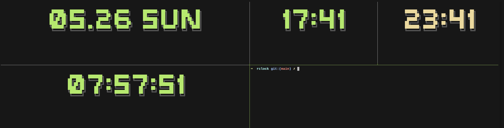

# rclock CLI Tool

This is a command-line tool written in Rust for displaying a clock or a countdown timer with customizable fonts and colors using the `cfonts` library. The tool can also execute a command when a timer completes.

## Features

- Display the current time in a specified timezone.
- Show a countdown timer for a given duration.
- Show the current date and weekday.
- Execute a command when the timer completes.
- Customizable font colors.

## Installation

1. Ensure you have Rust installed. If not, install it from [rust-lang.org](https://www.rust-lang.org/).
2. Clone this repository:
    ```sh
    git clone https://github.com/nuwak/rclock
    cd rclock
    ```
3. Build the project:
    ```sh
    cargo build --release
    sudo cp target/release/rclock /usr/local/bin
    ```
4. The executable will be located in `target/release/`. You can add it to your PATH for easier usage.

## Usage

The tool provides several options to customize its behavior. Here is the basic usage:

```sh
rclock [OPTIONS]
```

### Options

- `-c, --color <COLOR>`: Color index (1-9) for the font (default: 2).
- `-t, --timezone <TIMEZONE>`: Timezone for the clock (default: "Europe/Belgrade").
- `-d, --duration <DURATION>`: Countdown duration (e.g., '3h', '125m', '3:12:15').
- `-D, --date`: Display the current date and weekday.
- `-x, --command <COMMAND>`: Command to execute when the timer completes.
- `-T, --target-time <TARGET_TIME>`: Target time for countdown (e.g., '2024-12-31T23:59:59Z').

### Examples

1. **Display the current time in a specified timezone:**

    ```sh
    rclock --timezone "America/New_York"
    ```

2. **Display a countdown timer for 5 minutes:**

    ```sh
    rclock --duration "5m"
    ```

3. **Display the current date and weekday:**

    ```sh
    rclock --date
    ```

4. **Execute a command when the timer completes:**

    ```sh
    rclock --duration "1h" --command "echo 'Time is up!'"
    ```

5. **Countdown to a specific target time:**

    ```sh
    rclock --target-time "23:59:59"
    ```
6. **Other**

```shell
rclock -d '0:0:10' -x 'paplay files/notification.wav'
```

```shell
rclock -c 3 -t 'Asia/Manila'
```

```shell
rclock
```

```shell
rclock -T '23:0:0'
```

```shell
rclock -d '10m'
```

```shell
rclock -h
```

### TMUX

```shell
bash tmux.sh
```

### Controls

- Press `SPACE` to pause/resume the timer.
- Press `q` to quit the application.

## License

This project is licensed under the MIT License. See the `LICENSE` file for details.

## Contributions

Contributions are welcome! Please open an issue or submit a pull request on GitHub.

## Acknowledgements

- [cfonts](https://github.com/dominikwilkowski/cfonts) for the beautiful font rendering.
- [chrono](https://github.com/chronotope/chrono) for handling date and time.
- [clap](https://github.com/clap-rs/clap) for argument parsing.

## Author

- Nuwak - [GitHub](https://github.com/nuwak)


